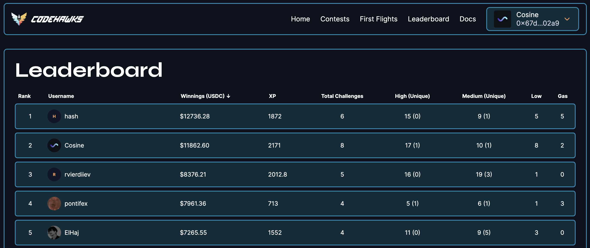

# About

I'm an independent security researcher who specializes in smart contracts.

My work can be found on various competitive audit platforms like [Codehawks](https://www.codehawks.com/profile/clkc7trh30004l208e0okerdn), [Code4rena](https://code4rena.com/@Cosine) and [Sherlock](https://audits.sherlock.xyz/watson/cosine).

Feel free to reach out for private audits, consulting, or any other inquiries via:

- **Discord**: cosine_function
- **Twitter**: [@cosine_wave](https://twitter.com/cosine_wave)
- **Telegram**: [@cosine_function](https://t.me/cosine_function)
- **Email**: cosine_wave@icloud.com

# Highlights

- Found a unique high on the DittoETH contest ([Report](https://solodit.xyz/issues/margin-callers-can-drain-the-tapp-during-liquidation-by-willingly-increase-gas-costs-with-the-shorthintarray-codehawks-dittoeth-git))
- Ranked #2 on the Codehawks 2023 leaderboard with 17 high and 10 medium severity vulnerabilities

# Competitive Audits

| Contest  | Description                                                                                                                                                                                                                                                                                                          | Platform  | Ranking  | Report                                                               |
| -------- | -------------------------------------------------------------------------------------------------------------------------------------------------------------------------------------------------------------------------------------------------------------------------------------------------------------------- | --------- | -------- | -------------------------------------------------------------------- |
| DittoETH | Ditto mints pegged assets (stablecoins) using an orderbook, using over-collateralized staked ETH.                                                                                                                                                                                                                    | Codehawks | 2 / 80   | [Report](https://www.codehawks.com/report/clm871gl00001mp081mzjdlwc) |
| Steadefi | Steadefi provides vaults with automated risk management for earning leveraged yields effectively and passively in bull, crab and bear markets. With lending and leveraged delta long and neutral stategies, Steadefi's vaults cater to different risk/reward strategies to the best yield-generating DeFi protocols. | Codehawks | 5 / 68   | [Report](https://www.codehawks.com/report/clo38mm260001la08daw5cbuf) |
| Basin    | A composable EVM-native decentralized exchange protocol.                                                                                                                                                                                                                                                             | Code4rena | 6 / 73   | [Report](https://code4rena.com/reports/2023-07-basin)                |
| ECG      | A trust minimized pooled lending protocol.                                                                                                                                                                                                                                                                           | Code4rena | 13 / 126 | [Report](https://code4rena.com/reports/2023-12-ethereumcreditguild)  |
